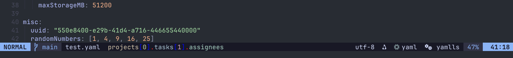

# KeyTrail.nvim
A Neovim plugin in pure lua that shows the current path in YAML and JSON files, with the ability to jump to any path in the document using fuzzyfinding search w/ telescope / filepickers.


## Features

- Shows the current path in YAML and JSON files
- Hover popup with the current path
- Jump to any path in the document using Telescope
- Yank (copy) the current path to clipboard
- Support for both YAML and JSON file types
- Configurable delimiter and hover delay
- Customizable key mapping

## Requirements

- Neovim 0.9.0 or higher
- [nvim-treesitter](https://github.com/nvim-treesitter/nvim-treesitter)
- [telescope.nvim](https://github.com/nvim-telescope/telescope.nvim) (or fzf-lua or any file picker)


## Keytrail Jump Config

Keytrail jump implements `vim.ui.select` which is a generic interface that is implemented with most pickers such as telescope, fzf-lua and others. For configuration for Telescope for example,
please ensure you have that implemented in your plugin configuration (e.g. `plugins/telescope.lua`).

telescope:
```lua
    extensions = {
        ["ui-select"] = {
            require("telescope.themes").get_dropdown {
                -- even more opts
            }
        }
    }
}

-- Set telescope as the picker for vim.ui.select
require("telescope").load_extension("ui-select")
```

fzf-lua:
```lua
-- Set fzf-lua as the picker for vim.ui.select
require('fzf-lua').register_ui_select()
```

## Installation

Using [lazy.nvim](https://github.com/folke/lazy.nvim):

```lua
{
    "jfryy/keytrail.nvim",
    dependencies = {
        "nvim-treesitter/nvim-treesitter"
    }
}
```

Using [packer.nvim](https://github.com/wbthomason/packer.nvim):

```lua
use {
    "jfryy/keytrail.nvim",
    requires = {
        "nvim-treesitter/nvim-treesitter",
        "nvim-telescope/telescope.nvim",
    },
    config = function()
        require("keytrail").setup()
    end,
}
```

## Configuration

KeyTrail can be configured by passing a table to the setup function:

```lua
require("keytrail").setup({
    -- The delimiter to use between path segments
    delimiter = ".",
    -- The delay in milliseconds before showing the hover popup
    hover_delay = 100,
    -- The highlight group (or table accepted by vim.api.nvim_set_hl) to style the popup background.
    -- Set to nil to reuse your theme's NormalFloat highlight.
    popup_highlight = nil,
    -- Popup-specific settings (winblend falls back to the top-level field for backward compatibility)
    popup = {
        enabled = true,
        winblend = 10,
    },
    -- Optional statusline integration (disabled by default)
    statusline = {
        enabled = false,
        prefix = " Path: ",
        suffix = "",
        empty = "",
    },
    -- The key mapping to use for jumping to a path
    key_mapping = "jq",
    -- The key mapping to use for yanking the current path
    yank_key_mapping = "jy",
    -- The file types to enable KeyTrail for
    filetypes = {
        yaml = true,
        json = true,
    },
})
```

### Styling
KeyTrail reuses your theme's `NormalFloat` highlight for the popup by default. If you would like a different look, set `popup_highlight` to another highlight group (for example `"Normal"` or `"TelescopeNormal"`) or pass a table such as `{ bg = "#1f2335", fg = "#c0caf5" }`. Combine this with `popup.winblend` (or the legacy top-level `winblend`) to tune how much of the underlying buffer shows through.

### Statusline
If you prefer to surface the path in your statusline instead of a popup:

1. Enable the statusline cache and (optionally) disable the popup in your setup:
   ```lua
   require("keytrail").setup({
       popup = { enabled = false },
       statusline = {
           enabled = true,
           prefix = "Path: ",
           empty = "",
       },
   })
   ```
2. Reference `require("keytrail").statusline` from your statusline. For the built-in statusline you can append:
   ```lua
   vim.o.statusline = vim.o.statusline .. " %"
   ```
   For frameworks such as `lualine.nvim`, just add `require("keytrail").statusline` as a component.

Lualine integration preview:



#### Lualine example (lazy.nvim)
```lua
return {
    -- KeyTrail plugin with statusline cache enabled
    {
        "jfryy/keytrail.nvim",
        opts = {
            popup = { enabled = false }, -- keep true if you still want the popup
            statusline = {
                enabled = true,
                prefix = "Path: ",
                empty = "",
            },
        },
    },
    -- Lualine configuration consuming the KeyTrail component
    {
        "nvim-lualine/lualine.nvim",
        dependencies = {
            "jfryy/keytrail.nvim",
            "nvim-tree/nvim-web-devicons",
        },
        config = function()
            local function keytrail_component()
                local ok, keytrail = pcall(require, "keytrail")
                if not ok then
                    return ""
                end
                return keytrail.statusline()
            end

            require("lualine").setup({
                options = {
                    component_separators = { left = "", right = "" },
                    section_separators = { left = "", right = "" },
                },
                sections = {
                    lualine_a = { "mode" },
                    lualine_b = { "branch", "diff", "diagnostics" },
                    lualine_c = {
                        "filename",
                        keytrail_component,
                    },
                    lualine_x = {
                        "encoding",
                        "fileformat",
                        "filetype",
                        {
                            function()
                                local clients = vim.lsp.get_clients({ bufnr = 0 })
                                if #clients == 0 then
                                    return ""
                                end
                                local names = {}
                                for _, client in ipairs(clients) do
                                    table.insert(names, client.name)
                                end
                                return table.concat(names, " ")
                            end,
                            icon = " ",
                        },
                    },
                    lualine_y = { "progress" },
                    lualine_z = { "location" },
                },
            })
        end,
    },
}
```

## Usage
KeyTrail provides the following commands:

- `:KeyTrail <path>` - Jump to the specified path
- `:KeyTrailJump` - Open Telescope to select and jump to a path
- `:KeyTrailYank` - Yank (copy) the current path to the clipboard

By default, KeyTrail maps `<leader>jq` to `:KeyTrailJump` and `<leader>jy` to `:KeyTrailYank` in normal mode.
